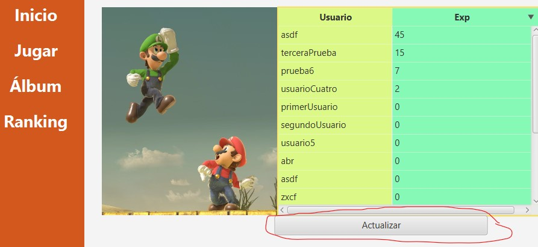
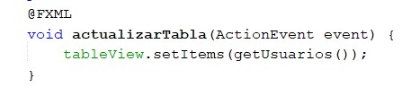
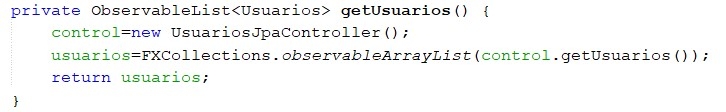
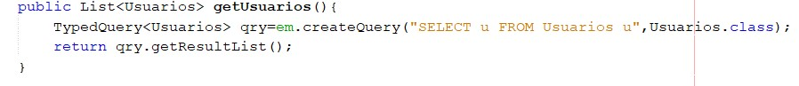

# Evidencia del uso de arquitectura MVC
## Explicación
Para mostrar el hecho de que se está utilizando la arquitectura MVC se usará como ejemplo el uso de la funcionalidad de ver el ranking.

1. El usuario presiona el botón de actualizar los datos, interactuando con la interfaz.  

2. Esta acción provoca que el controlador tome el evento y realice una acción en específico, que en este caso sería pedir los datos de la tabla a la base de datos.  

3. La base de datos da la información de la tabla, la cual es obtenida por el controlador.  

4. El controlador refleja los datos actualizados de la tabla en la interfaz.  

